# Jarkom-Modul-1-ITB10-2022

**Jovan Surya Bako 5027201013**		

**Gde Rio Aryaputra Rahadi   5027201063**

## :large_blue_circle: **Soal 1** :large_blue_circle: 

## **1**
Sebutkan web server yang digunakan pada "monta.if.its.ac.id"! 

jika dilihat dari wireshark pada No 446 ditunjukan response 200 ok yang mana jika dilihat dari Hypertext Transfer Protocol, pada bagian server menunjukan bahwa server yang digunakan adalah nginx
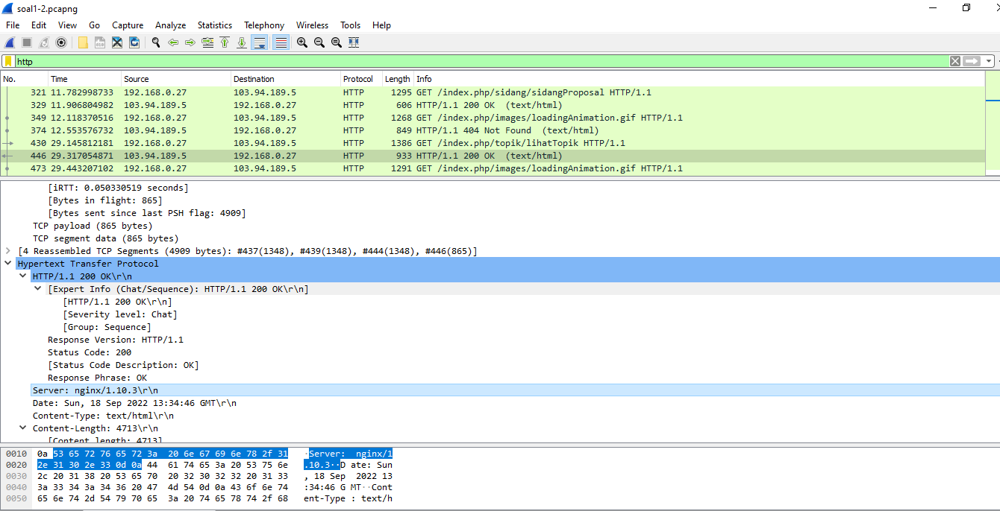

**sebelumnya kami menyelesaikan masalah ini dengan menggunakan httaccess untuk mendapatkan web server yang digunakan**

## **2**
Ishaq sedang bingung mencari topik ta untuk semester ini , lalu ia datang ke website monta dan menemukan detail topik pada website “monta.if.its.ac.id” , judul TA apa yang dibuka oleh ishaq ?

awalnya kami DisplayFilters monta.if.its.ac.id, akan ada salah satu yang menunjukan detail topik
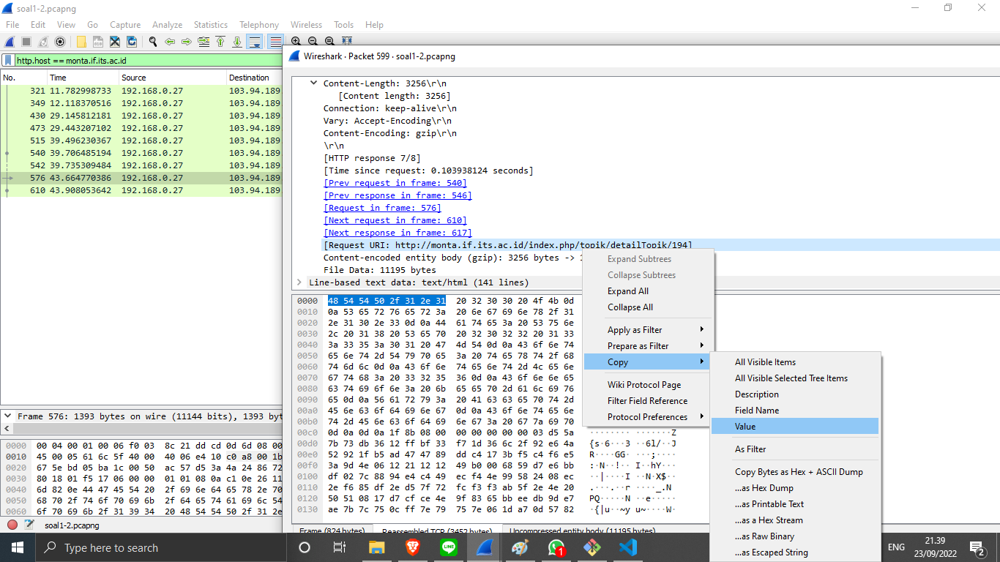
lalu dibuka dan di lihat bagian Request URI, lalu di copy valuenya
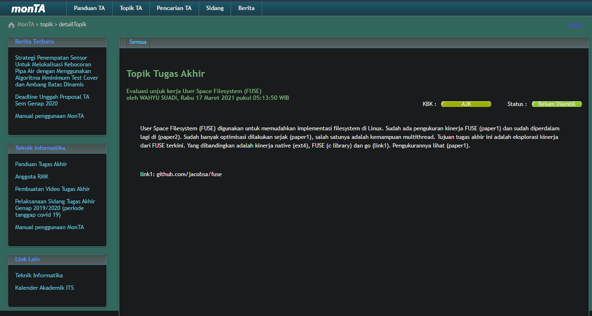
 
**sebelumnya kami menggunakan HTTP export object untuk menemukan judul TA yang dibuka oleh ishaq**

## **3**
Filter sehingga wireshark hanya menampilkan paket yang menuju port 80! 

disini kami menggunakan tcp.dstport == 80 || udp.dstport == 80 melihat paket apa saja yang menuju ke port 80, berdasarkan file yang diberikan
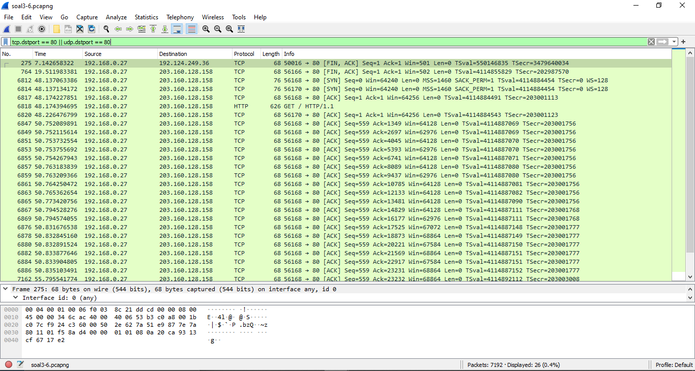

## **4**
Filter sehingga wireshark hanya mengambil paket yang berasal dari port 21!
untuk pengecekan paket yang berasal dari port 21 bisa menggunakan tcp.srcport == 21 || udp.srcport == 21
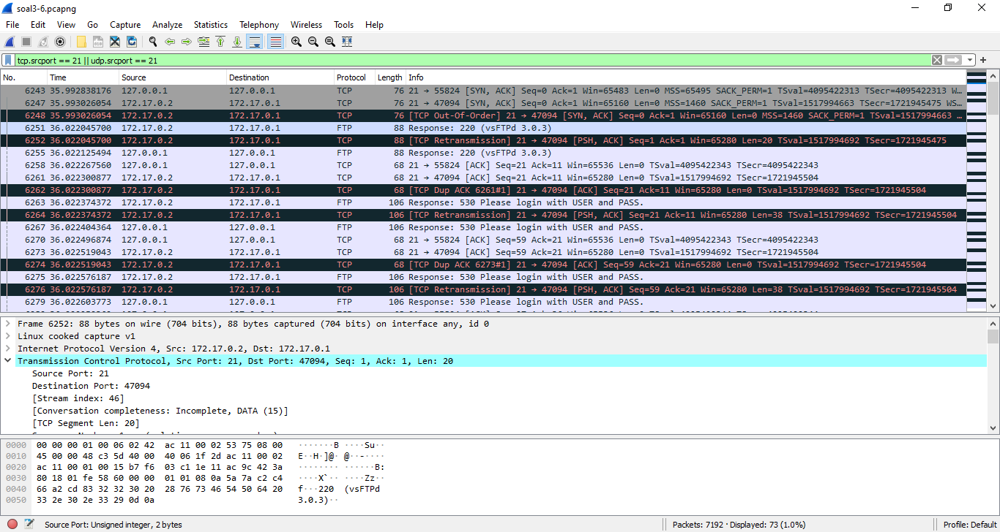

## **5**
Filter sehingga wireshark hanya mengambil paket yang berasal dari port 443!
untuk mengecek paket yang berasal dari port 443 bisa menggunakan 
tcp.srcport == 443 || udp.srcport == 443

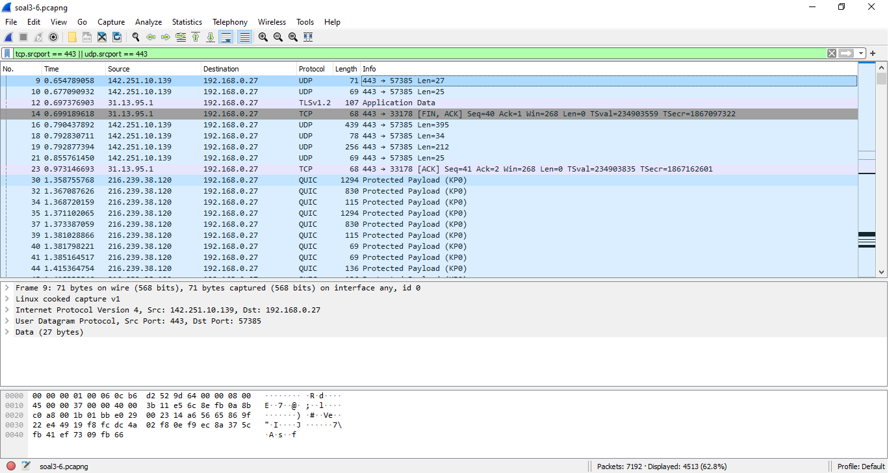

## **6**
Filter sehingga wireshark hanya menampilkan paket yang menuju ke lipi.go.id !
untuk mengecek paket yang menju lipi.go.id kami mencari tahu terlebih dahulu IP address lipi.go.id dari cmd dengan ping ke alamat web tersebut, setelah itu barulah  menggunakan ip.dst_host == 203.160.128.158 
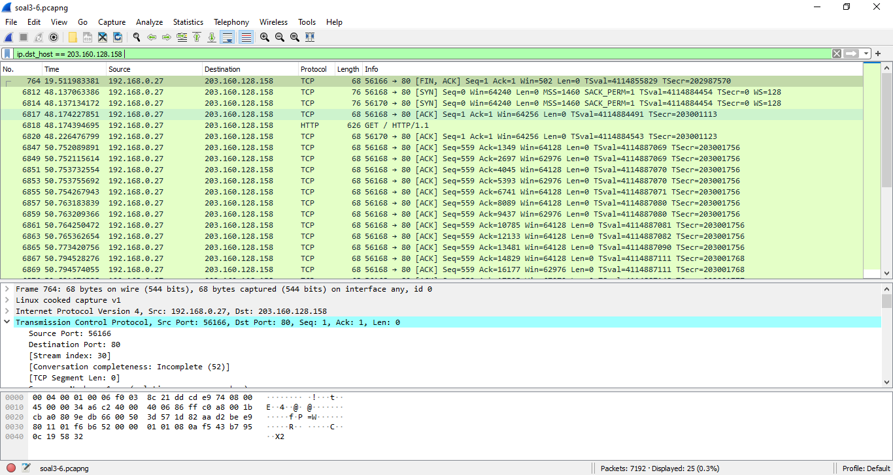

## **7**
Filter sehingga wireshark hanya mengambil paket yang berasal dari ip kalian!
Untuk mengecek paket yang berasal dari IP sendiri dapat menggunakan filter expression ip.src == "+IP sendiri"

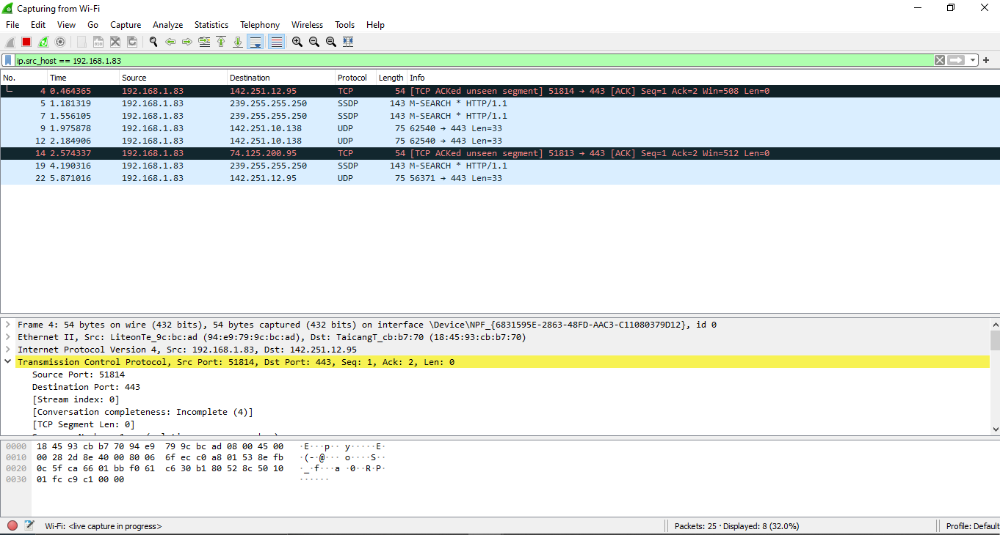

## **8**
Telusuri aliran paket dalam file .pcap yang diberikan, cari informasi berguna berupa percakapan antara dua mahasiswa terkait tindakan kecurangan pada kegiatan praktikum. Percakapan tersebut dilaporkan menggunakan protokol jaringan dengan tingkat keandalan yang tinggi dalam pertukaran datanya sehingga kalian perlu menerapkan filter dengan protokol yang tersebut.

Setelah menggunakan filter tcp, kami menemukan IP yang mengirim pesan mencurigakan dari terduga mahasiswa yang melakukan kecurangan, IP yang digunakan adalah 127.0.1.1(mhs1) dan 127.0.0.1(mhs2). 
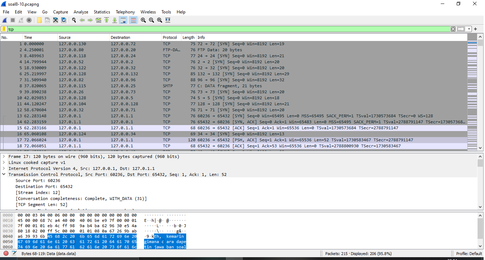
untuk mempermudah pembacaan kami menggunakan filter ip.host == 127.0.1.1 && ip.host == 127.0.0.1 
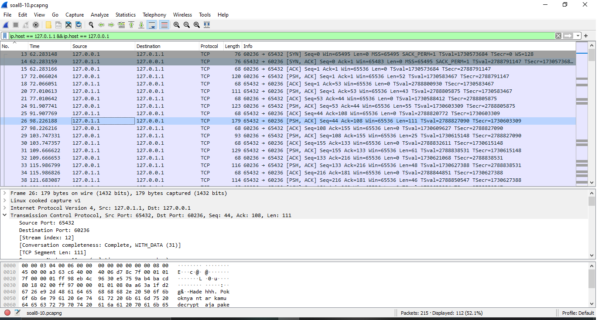
 Mhs2 meminta bantuan pada mhs 1 mengenai cara mendapatkan soal shift dan juga ada pengiriman file dari mhs1 ke mhs2
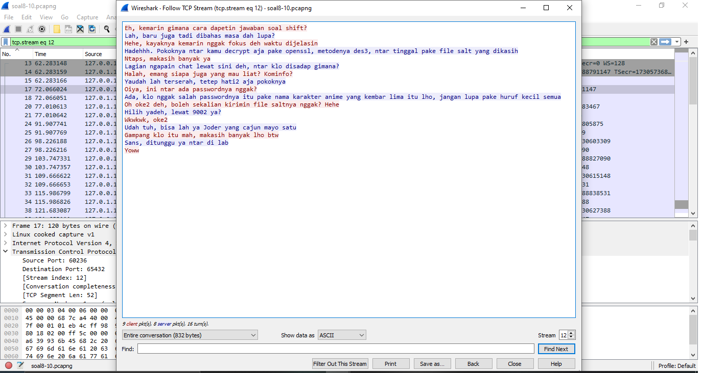
 file tersebut akan dikirim melalu port 9002
 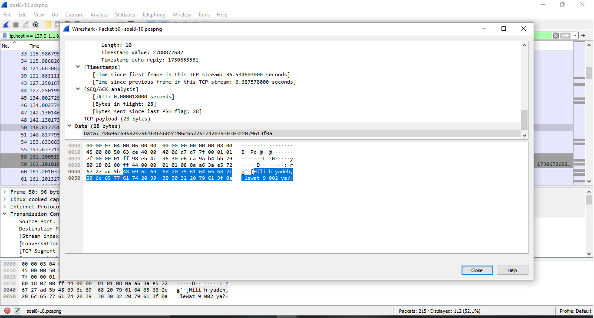
percakapan tersebut dilanjutkan dengan mhs 127.0.0.1 bertanya mengenai password yang benar
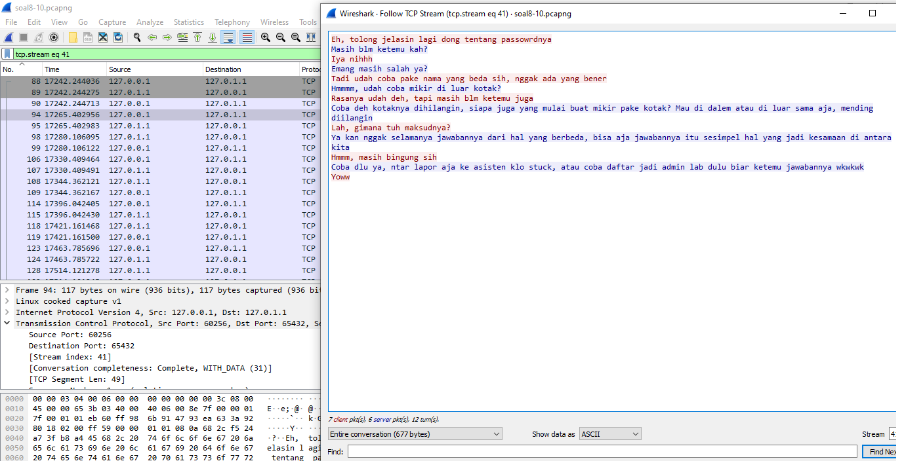
**sebelumnya kami hanya memasukan 1 potongan percakapan saja**

## **9**
Terdapat laporan adanya pertukaran file yang dilakukan oleh kedua mahasiswa dalam percakapan yang diperoleh, carilah file yang dimaksud! Untuk memudahkan laporan kepada atasan, beri nama file yang ditemukan dengan format [nama_kelompok].des3 dan simpan output file dengan nama “flag.txt”.

seperti yang ditemukan pada nomor 8, ada file yang di kirim pada port 9002
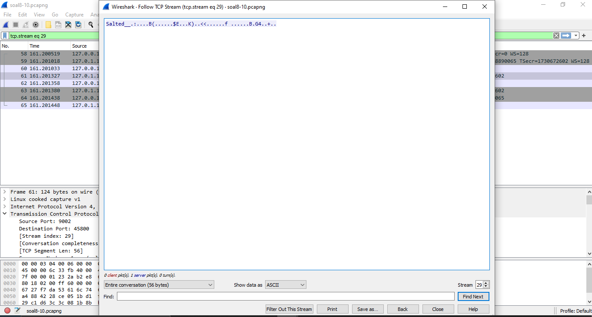
file tersebut di save terlebih dahulu dalam bentuk raw, barulah bisa di decrypt

**sebelumnya kami menyimpan file tersebut dengan ASCII yang mana jika di decrypt akan menampilkan jawaban yang salah**

## **10**

Temukan password rahasia (flag) dari organisasi bawah tanah yang disebutkan di atas!
kami menggunakan openssl di windows untuk mendecrypt file tersebut
berikut adalah command yang kami gunakan

openssl des3 -d -salt -in ITB10.des3 -out flag.txt  
dan passwordnya adalah nakano
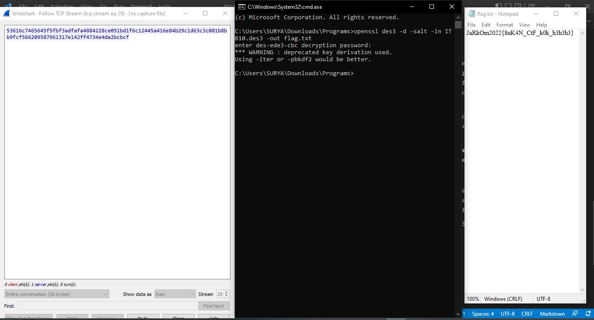
hasil yang didapatkan adalah
JaRkOm2022{8uK4N_CtF_k0k_h3h3h3}

